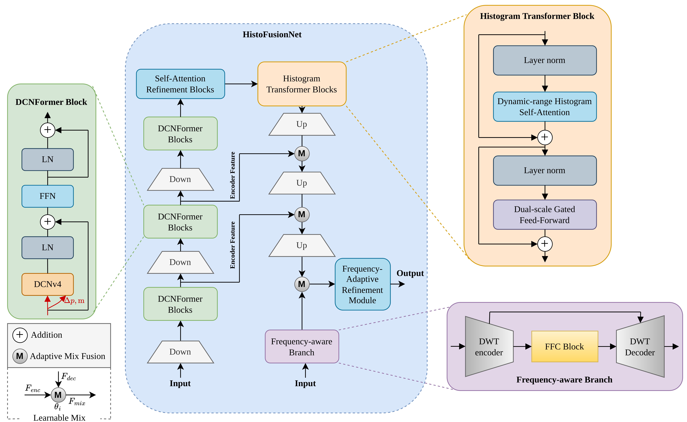

<div align="center">

# HistoFusionNet: Histogram-Guided Fusion and Frequency-Adaptive Refinement for Nighttime Image Dehazing

### CVPR 2026

### 11th New Trends in Image Restoration and Enhancement Workshop

Mohammad Heydari*, Wei Dong*, Shahram Shirani, Jun Chen, Han Zhou
\* Equal contribution

[](https://arxiv.org/abs/2604.03800)
[](#)
[](https://github.com/heydarimo/Night-Time-Dehazing)

</div>

---

## Method Overview

<p align="center">
  
</p>

Nighttime image dehazing is a challenging image restoration problem because real nighttime scenes often contain spatially varying haze, non-uniform illumination, glow from artificial light sources, color distortion, low contrast, and sensor noise. These degradations are more complex than those in standard daytime dehazing, where the main degradation is usually modeled as atmospheric scattering. As a result, many existing dehazing approaches struggle to recover clear structure, faithful color, and fine details in nighttime environments.

In our CVPR 2026 paper, we present **HistoFusionNet**, a histogram-guided fusion and frequency-adaptive refinement framework for nighttime image dehazing. The proposed network is designed to combine global distribution-aware representation learning with local detail restoration. Specifically, HistoFusionNet uses histogram-guided modeling to capture illumination and intensity-distribution priors that are important for nighttime scenes with severe brightness imbalance and haze-density variation. This helps the network better understand global degradation patterns and restore visually consistent results.

To further improve restoration quality, HistoFusionNet incorporates a frequency-adaptive refinement strategy. This component enhances structural details, suppresses artifacts, and improves texture recovery by refining the restored image in a frequency-aware manner. By combining histogram-guided fusion with frequency-domain refinement, HistoFusionNet effectively reduces haze, glow, color shifts, and contrast degradation while preserving image details. The framework achieves strong performance on nighttime and dense haze benchmarks and is presented at **CVPR 2026** in the **11th New Trends in Image Restoration and Enhancement Workshop**.

---

## Overview

This repository provides the code and full implementation of **HistoFusionNet**, the method presented in our **CVPR 2026 paper**:

> **HistoFusionNet: Histogram-Guided Fusion and Frequency-Adaptive Refinement for Nighttime Image Dehazing**

The paper is presented at **CVPR 2026** in the **11th New Trends in Image Restoration and Enhancement Workshop**.

This README is organized to guide users through the repository in a practical order. The first part provides instructions for running **challenge inference** using the released model checkpoint. The second part explains how to reproduce the results reported in the paper, including the required artifacts, datasets, checkpoints, and evaluation commands. The final part provides the training commands used for the supported datasets before applying frequency-adaptive refinement fine-tuning.

The repository includes:

* Full implementation of HistoFusionNet.
* Inference code for reproducing the released challenge submission results.
* Environment files for reproducibility.
* Released checkpoints and pretrained backbone loading instructions.
* Evaluation commands for NH-Haze, NH-Haze2, and Dense-Haze.
* Training commands for the released experimental setup.
* Instructions for reproducing the results reported in the paper.

For paper-level reproduction, please refer to the [Reproducibility of Paper Results](#reproducibility-of-paper-results) section.

---

## Environment

The experiments were conducted using:

```bash
Python 3.8.20
```

Two environment files are provided for reproducibility:

* `environment.yml`
* `requirements.txt`

### Option 1: Conda

```bash
conda env create -f environment.yml
conda activate dehazedct
```

### Option 2: Pip

```bash
pip install -r requirements.txt
```

---

## Dataset Setup for Challenge Inference

Place the 5 test images in the following directory:

```bash
data/challenge_test/hazy/
```

Expected structure:

```bash
.
├── data/
│   └── challenge_test/
│       └── hazy/
│           ├── 31_NTHazy.png
│           ├── 32_NTHazy.png
│           ├── 33_NTHazy.png
│           ├── 34_NTHazy.png
│           └── 35_NTHazy.png
├── DCNv4_op/
├── predict_stage2_ensemble.py
├── environment.yml
├── requirements.txt
├── final.pth
└── flash_intern_image_l_22kto1k_384.pth
```

---

## Checkpoints

Download the following files from the Google Drive folder and place them in the repository root directory:

* `final.pth` — best challenge checkpoint
* `flash_intern_image_l_22kto1k_384.pth` — pretrained FlashInternImage backbone

Google Drive folder:

```text
https://drive.google.com/drive/folders/1uP5ZUUcnkXYPO_PgCiayVXFcZ27ftzIi?usp=sharing
```

---

## DCNv4 Setup

To install the DCNv4 operator used in the model, run:

```bash
cd DCNv4_op
bash make.sh
cd ..
```

Depending on your local CUDA and PyTorch build environment, this step may require minor adjustment.

---

## Challenge Inference

Run the following command from the repository root:

```bash
python predict_stage2_ensemble.py \
    --data_root ./data/challenge_test \
    --ckpt ./final.pth \
    --out_dir ./out \
    --device cuda:0 \
    --mode fullpad \
    --mod 32 \
    --pad_mode reflect
```

The dehazed results will be saved to:

```bash
./out/
```

---

## Reproducibility of Paper Results

To reproduce the paper results, including the generation of dehazed images on the test data and the quantitative metrics reported in the paper, download the **`artifacts`** folder from the Google Drive link below.

Google Drive artifacts folder:

```text
https://drive.google.com/drive/folders/14UvIxnu40E0EYuOfGfAjX_IbFzWZwBCm?usp=sharing
```

After downloading, place the `dataset` and `checkpoints` folders in a local directory using the following structure:

```bash
artifacts/
├── dataset/
│   ├── Dense-Haze/
│   │   ├── train/
│   │   └── test/
│   ├── NH-Haze/
│   │   ├── train/
│   │   └── test/
│   └── NH-Haze2/
│       ├── train/
│       └── test/
└── checkpoints/
    └── HistoFusionNet/
        ├── Checkpoints_DenseHaze/
        │   └── best_psnr.pkl
        ├── Checkpoints_NH_Haze/
        │   └── best_psnr.pkl
        └── Checkpoints_NH_Haze2/
            └── best_psnr.pkl
```

> **Note:** The `train/` and `test/` subdirectory structure is the same for all three datasets.

---

## Evaluation

The following commands reproduce the generation of dehazed images on the test sets and the quantitative results reported in the paper.

### Evaluation on NH-Haze

```bash
python predict.py \
  --data_root ./artifacts/dataset/NH-Haze/test/ \
  --ckpt ./artifacts/checkpoints/HistoFusionNet/Checkpoints_NH_Haze/best_psnr.pkl \
  --out_dir results_NH_Haze \
  --device cuda:0 \
  --mode fullpad \
  --mod 32 \
  --pad_mode reflect \
  --num_workers 0 \
  --sanity
```

### Evaluation on NH-Haze2

```bash
python predict.py \
  --data_root ./artifacts/dataset/NH-Haze2/test/ \
  --ckpt ./artifacts/checkpoints/HistoFusionNet/Checkpoints_NH_Haze2/best_psnr.pkl \
  --out_dir results_NH_Haze2 \
  --device cuda:0 \
  --mode fullpad \
  --mod 32 \
  --pad_mode reflect \
  --num_workers 0 \
  --sanity
```

### Evaluation on Dense-Haze

```bash
python predict_dense.py \
  --data_root ./artifacts/dataset/Dense-Haze/test/ \
  --ckpt ./artifacts/checkpoints/HistoFusionNet/Checkpoints_DenseHaze/best_psnr.pkl \
  --out_dir results_DenseHaze \
  --device cuda:0 \
  --mode fullpad \
  --mod 32 \
  --pad_mode reflect \
  --num_workers 0 \
  --sanity
```

The generated dehazed images will be saved in the corresponding output directories:

```bash
results_NH_Haze/
results_NH_Haze2/
results_DenseHaze/
```

---

## Training Commands

The following commands correspond to training on the different datasets before applying frequency-adaptive refinement fine-tuning.

### Training on NH-Haze

```bash
python train.py \
  --dataset_root ./artifacts/dataset/NH-Haze \
  --crop_size 384 \
  -train_batch_size 2 \
  -train_epoch 5000 \
  --model_save_dir ./artifacts/checkpoints/HistoFusionNet/Checkpoints_NH_Haze \
  --denet_save_dir ./artifacts/checkpoints/HistoFusionNet/Checkpoints_NH_Haze \
  --log_txt train_loss_NH_Haze.txt \
  --excel_txt test_metrics_NH_Haze.xlsx
```

### Training on NH-Haze2

```bash
python train.py \
  --dataset_root ./artifacts/dataset/NH-Haze2 \
  --crop_size 384 \
  -train_batch_size 2 \
  -train_epoch 5000 \
  --model_save_dir ./artifacts/checkpoints/HistoFusionNet/Checkpoints_NH_Haze2 \
  --denet_save_dir ./artifacts/checkpoints/HistoFusionNet/Checkpoints_NH_Haze2 \
  --log_txt train_loss_NH_Haze2.txt \
  --excel_txt test_metrics_NH_Haze2.xlsx
```

### Training on Dense-Haze

```bash
python train.py \
  --dataset_root ./artifacts/dataset/Dense-Haze \
  --crop_size 384 \
  -train_batch_size 2 \
  -train_epoch 5000 \
  --model_save_dir ./artifacts/checkpoints/HistoFusionNet/Checkpoints_DenseHaze \
  --denet_save_dir ./artifacts/checkpoints/HistoFusionNet/Checkpoints_DenseHaze \
  --log_txt train_loss_dense_haze.txt \
  --excel_txt test_metrics_dense_haze.xlsx
```

---

## Notes

* This README is intended for inference-time reproduction of the released challenge results and paper results.
* Please use the provided environment files, released checkpoints, and the same inference settings.
* Minor numerical differences may occur across different hardware or software environments, but the reproduced results should remain at the same performance level.

---

## Citation

If you find this repository useful for your research, please consider citing our paper:

```bibtex
@article{heydari2026histofusionnet,
  title={HistoFusionNet: Histogram-Guided Fusion and Frequency-Adaptive Refinement for Nighttime Image Dehazing},
  author={Heydari, Mohammad and Dong, Wei and Shirani, Shahram and Chen, Jun and Zhou, Han},
  journal={arXiv preprint arXiv:2604.03800},
  year={2026}
}
```

---

## Contact

For questions or future contact, please email:

```text
mohammadheydari.eduu@gmail.com
```
